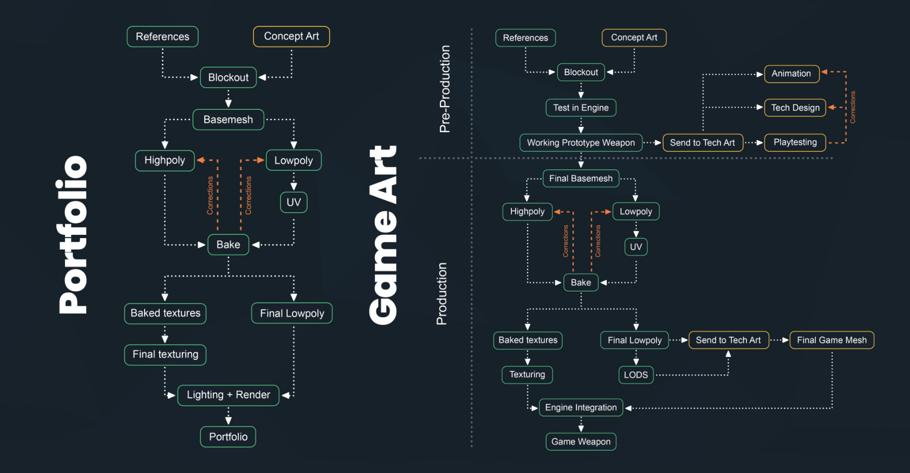
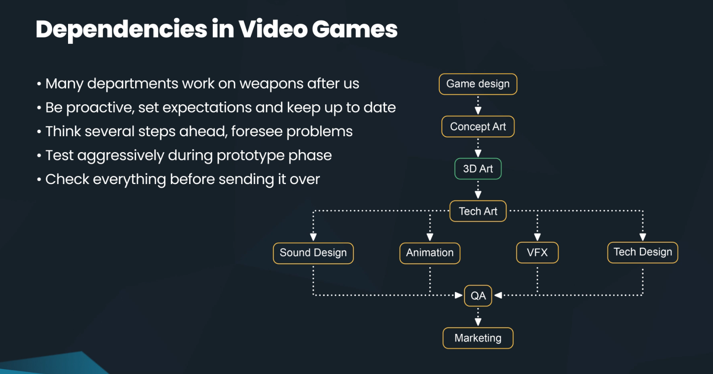
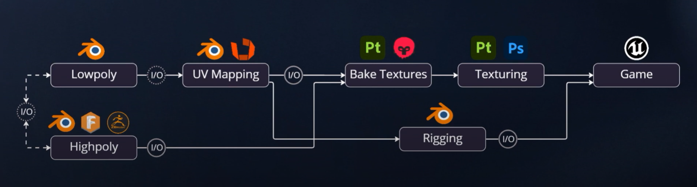
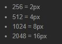
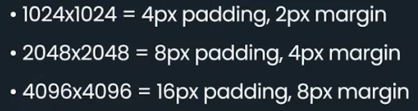

---
hide:
 - toc
 - path
 - title
---

## Game Asset Pipeline
#### Crytek's Workflow

#### Embark Studios Workflow

---

## UV Margin

Creating an Assault Rifle in Substance 3D Painter and Unreal Engine 5 [80lv](https://80.lv/articles/creating-an-assault-rifle-in-sunstance-3d-painter-and-unreal-engine-5/)

Fusion 360 Weapon Course [Artstation Learning](https://www.artstation.com/learning/instructors/Duard-Mostert)

Hard Surface Modling - Crytek Dev [Artstation Learning](https://www.artstation.com/learning/series/qrq/weapon-development-in-blender?utm_source=artstation&utm_medium=onsite_notification&utm_campaign=series)
